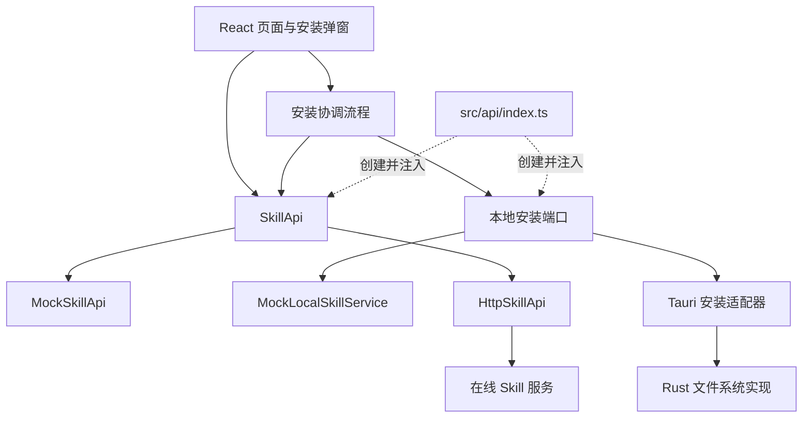

# Kocotree Skills 架构说明

## 1. 架构目标

Kocotree Skills 当前包含在线 Skill 平台和平台版本安装两个领域：

- 在线平台负责浏览、详情、版本、发布、协作和下载凭证。
- 安装能力负责把用户选择的平台版本安全写入本机 Skill 目录。
- React 页面不直接访问文件系统、Tauri 命令或 HTTP。
- 在线服务不能直接读写用户磁盘。
- 本地安装成功后再向在线服务上报安装事件。
- 在线上报失败不能回滚已经成功的本地安装。

当前本地范围只包含安装。安装过程中使用的目标检查、冲突备份、原子替换、失败回滚和安装凭证属于安装安全机制，不作为独立的本地管理功能提供。

以下能力不在当前范围：

- 扫描并管理任意本地 Skill。
- 识别未知来源、本地修改或丢失目录。
- 单独移除 Skill。
- 展示备份列表或手动恢复备份。
- 恢复任意本地 Skill 与平台版本的关联。
- 管理 Claude 目录链接。
- 自动替换同一派生链上的其他 Skill。

## 2. 当前项目基础

架构直接建立在现有代码上。

| 当前模块 | 当前职责 | 架构归属 |
| --- | --- | --- |
| `src/App.tsx` | 应用外壳、登录拦截、安装确认、下载凭证、本地安装和安装上报编排 | 页面层与当前安装用例 |
| `src/components/InstallConfirmModal.tsx` | 安装版本确认和同名冲突确认 | 安装展示层 |
| `src/components/InstallFeedbackModal.tsx` | 安装成功、降级、回滚和提示反馈 | 安装展示层 |
| `src/api/contracts.ts` | OpenAPI DTO、`SkillApi`、`LocalSkillService` 和安装模型 | 在线端口与本地端口 |
| `src/api/mockSkillApi.ts` | 在线平台内存模拟 | `SkillApi` 的 Mock 适配器 |
| `src/api/mockLocalSkillService.ts` | 安装、同名冲突和结果模拟 | `LocalSkillService` 的 Mock 适配器 |
| `src/api/index.ts` | 创建并导出共享服务实例 | 应用组合入口 |
| `src/api/skillPackage.ts`、`src/api/zipInspector.ts` | ZIP 路径检查、文件清单、元数据和哈希 | 客户端包检查规则 |
| `docs/openapi.yaml`、`src/api/schema.d.ts` | 在线 HTTP 契约及生成类型 | 在线领域契约 |
| `src-tauri/src/lib.rs` | Tauri 启动和命令注册入口 | 本地适配器入口 |

当前页面通过 `skillApi` 和 `localSkillService` 访问数据。浏览器开发与前端测试使用 Mock；真实后端和真实磁盘安装命令尚未接入。

“我的 Skill”中的本地页签目前展示 Mock 数据，不代表真实磁盘扫描能力。

## 3. 领域边界

### 3.1 在线平台

在线平台通过 `SkillApi` 提供：

- 浏览、搜索和筛选 Skill。
- 查询 Skill 详情与指定版本。
- 创建 Skill 和发布版本。
- 获取短期下载凭证。
- 上报幂等的安装成功事件。
- 执行归档、撤回、协作和所有权管理。

OpenAPI 只描述在线 HTTP 契约，不描述 Tauri 命令或本地文件系统结构。

### 3.2 本地安装

本地安装适配器负责：

- 接收已经确定的目标版本和安装包。
- 校验安装目标名称、包哈希和内容哈希。
- 安全解析 ZIP，拒绝路径穿越、链接和越界路径。
- 检查目标目录是否冲突。
- 在用户确认后备份冲突目录。
- 通过临时目录和原子替换完成安装。
- 安装失败时恢复原目录。
- 写入本次安装所需的最小凭证。

本地安装适配器不负责在线查询、登录、页面交互或平台统计。

### 3.3 安装协调

安装协调流程组合 `SkillApi` 与本地安装适配器：

1. 获取目标 Skill 与版本。
2. 获取下载凭证和安装包。
3. 转换为本地安装请求。
4. 调用本地安装适配器。
5. 处理同名冲突并等待用户确认。
6. 本地安装成功后上报安装事件。

协调流程不直接操作磁盘，也不实现服务端业务规则。

### 3.4 身份

身份适配器负责获取当前用户和 Bearer Token。平台安装是在线写操作，需要登录；登录协议和令牌生命周期由后续认证接入方负责。

## 4. 分层与依赖方向



依赖方向固定为“页面 → 协调流程或接口 → 适配器”。`src/api/index.ts` 是组合入口：浏览器环境注入 Mock，桌面环境注入 Tauri 本地实现，接入后端时注入 HTTP 在线实现。

## 5. 数据归属

| 数据 | 事实来源 | 持久化位置 |
| --- | --- | --- |
| 在线 Skill、版本和平台信息 | 在线服务 | 服务端 |
| 下载凭证 | 在线服务 | 客户端短期内存 |
| 下载缓存 | 安装流程 | 系统临时目录 |
| 生效 Skill 目录 | 本地安装流程 | `~/.agents/skills/<skillName>` |
| 冲突备份 | 本地安装流程 | `~/.agents/.kocotree/backups/` |
| 安装凭证 | 本地安装流程 | `~/.agents/.kocotree/installations/` |
| 登录身份和令牌 | 身份适配器 | 由认证接入方定义 |

安装凭证只保存安装校验与后续覆盖判断需要的 `skillId`、`versionId`、版本号、安装路径、`contentHash` 和安装时间，不保存用户令牌或在线展示文案。

## 6. 核心接口

### 6.1 SkillApi

现有 `SkillApi` 作为在线端口，继续负责详情、版本、下载凭证和安装上报。`MockSkillApi` 用于浏览器开发和测试，后端接入时增加 `HttpSkillApi`。

### 6.2 本地安装端口

当前 `LocalSkillService` 保留已有接口，页面现有调用不需要整体重写。真实适配器只实现安装主流程需要的能力；`scanSkills` 和 `remove` 不进入本阶段的真实磁盘实现。

安装请求应逐步收敛为本地值对象，不直接接收完整在线 DTO：

```ts
interface PlatformInstallRequest {
  skillId: string;
  versionId: string;
  version: string;
  skillName: string;
  packagePath: string;
  packageSha256: string;
  contentHash: string;
  force: boolean;
}

interface PlatformInstallResult {
  installedPath: string;
  backupPath?: string;
  installedAt: string;
}
```

本地错误使用独立错误类型，至少区分：

- 包校验失败。
- 安装目标冲突。
- 用户未确认覆盖。
- 文件系统权限不足。
- 原子替换失败且原目录已恢复。
- 原子替换失败且需要人工检查。

### 6.3 安装协调服务

`App.tsx` 当前直接串联下载凭证、详情查询、本地安装和安装上报。实现真实安装时把这段流程提取为单一安装协调服务：

```ts
interface InstallationService {
  installPlatformVersion(input: {
    skillId: string;
    versionId: string;
    force: boolean;
  }): Promise<PlatformInstallResult>;
}
```

`App.tsx` 保留登录拦截、弹窗状态和 Toast。协调服务负责在线 DTO 转换、下载、本地安装和成功上报。

## 7. 安装流程

### 7.1 正常安装

1. 在线服务确认目标 Skill 与版本可安装。
2. 客户端获取短期下载凭证并下载到临时目录。
3. 校验 ZIP 的 `packageSha256`。
4. 本地适配器安全解析 ZIP 并校验 `contentHash`。
5. 将内容写入同一磁盘分区的临时目录。
6. 最终检查文件清单和目标路径。
7. 原子切换到生效目录。
8. 原子写入安装凭证。
9. 清理下载缓存。
10. 使用唯一事件编号上报安装成功。

本地替换完成后即视为安装成功。安装事件上报失败时保留本地安装结果，并使用同一事件编号重试。

### 7.2 同名冲突

1. 目标目录不存在时直接进入正常安装。
2. 目标目录存在且内容与目标版本一致时返回已安装结果。
3. 目标目录存在且内容不同时停止写入，向页面返回冲突信息。
4. 用户明确确认后创建内部备份，再执行原子替换。
5. 安装成功后保留最近的安全备份；不提供独立备份管理页面。

### 7.3 失败回滚

1. 新内容始终先写入临时目录。
2. 切换生效目录前保留原目录的可恢复副本。
3. 解压、校验、写入凭证或替换失败时恢复原目录。
4. 回滚成功与失败使用不同错误码和提示。
5. 失败安装不提交在线安装事件。

### 7.4 历史版本

历史版本安装沿用同一流程。页面展示当前版本、目标版本和更新说明，用户确认后执行安装；客户端不自动降级或切换撤回版本。

## 8. 安全与原子性

- 拒绝绝对路径、路径穿越、符号链接、目录联接和大小写冲突。
- 限制包大小、解压大小、文件数量和单文件大小。
- 安装过程不执行包中的脚本或二进制文件。
- ZIP 先校验 `packageSha256`，解压结果再校验 `contentHash`。
- 下载缓存、临时目录、备份和最终目录必须限定在解析后的明确位置。
- 目录替换和凭证写入使用临时路径配合原子重命名。
- Rust 层使用标准日志记录下载完成、校验结果、冲突判断、备份、替换、回滚和异常。

## 9. 跨平台边界

React 和安装协调服务不包含 Windows、macOS 或 Linux 路径逻辑。

Rust 适配器负责：

- 解析用户主目录和规范化安装目标。
- 处理平台权限、文件占用和原子重命名差异。
- 返回统一安装结果和错误码。

Windows 与 macOS 使用同一安装端口和安全规则，分别通过临时目录集成测试验证正常安装、同名冲突、覆盖确认和失败回滚。

## 10. 代码落点

真实安装按以下边界落地：

```text
src/
├─ App.tsx
├─ components/
│  ├─ InstallConfirmModal.tsx
│  └─ InstallFeedbackModal.tsx
└─ api/
   ├─ contracts.ts
   ├─ index.ts
   ├─ installationService.ts
   ├─ mockSkillApi.ts
   ├─ mockLocalSkillService.ts
   ├─ tauriInstaller.ts
   └─ httpSkillApi.ts

src-tauri/src/
├─ lib.rs
└─ installer/
   ├─ mod.rs
   ├─ validate.rs
   ├─ install.rs
   ├─ backup.rs
   └─ credentials.rs
```

`index.ts` 负责创建在线端口、本地安装端口和安装协调服务。安装器内部的 `backup.rs` 只服务于覆盖保护和失败回滚。

## 11. 实施计划

### 阶段一：收敛安装编排

- 从 `App.tsx` 提取单一安装协调服务。
- 调整安装请求，隔离在线 DTO 与本地值对象。
- 增加独立本地安装错误类型。
- 保持现有弹窗、Toast 和 Mock 安装演示可用。

### 阶段二：真实安装适配器

- 接入真实下载凭证和包下载。
- 实现 Tauri 安装命令与 Rust 文件系统适配器。
- 实现包校验、安全解压、同名冲突、原子替换和失败回滚。
- 原子写入最小安装凭证。
- 增加正常安装、强制安装、权限失败和回滚的临时目录测试。

### 阶段三：在线联调

- 接入 `HttpSkillApi`。
- 本地安装成功后提交幂等安装事件。
- 覆盖最新版本、历史版本、撤回版本和在线上报失败场景。
- 完成 Windows 与 macOS 安装验证。

## 12. 文档职责

- 本文档定义在线平台与本地安装的架构边界。
- [`PRODUCT_DESIGN.md`](./PRODUCT_DESIGN.md) 定义产品行为和业务规则。
- [`API_REFERENCE.md`](./API_REFERENCE.md) 与 [`openapi.yaml`](./openapi.yaml) 定义在线 HTTP 契约。
- [`adr/0003-local-installation-state.md`](./adr/0003-local-installation-state.md) 记录安装状态和安全边界。
