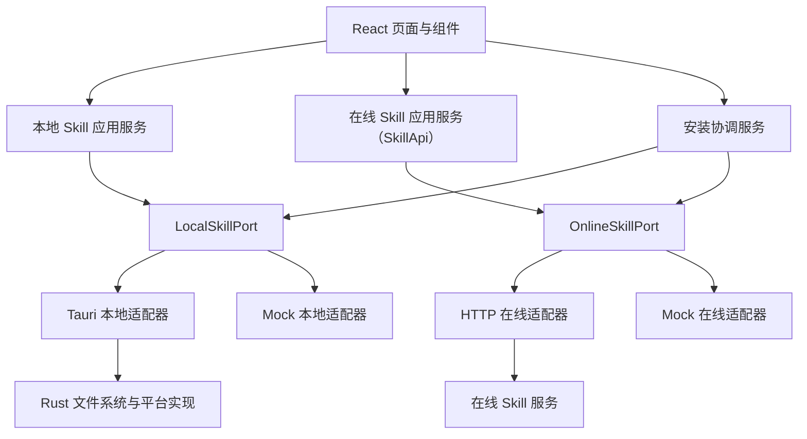

# Kocotree Skills 架构说明

## 1. 架构目标

Kocotree Skills 同时包含本地 Skill 管理和在线 Skill 平台两个领域。两者共享 Skill 名称、版本和内容哈希等关联信息，但拥有不同的事实来源、可用条件和写入边界。

架构遵循以下原则：

- 本地 Skill 以当前设备的磁盘内容为事实来源。
- 在线 Skill 以服务端 API 返回的数据为事实来源。
- 扫描、查看、备份、恢复和移除本地 Skill 不依赖登录或网络。
- 在线信息只增强本地展示，查询失败不能隐藏、删除或改变本地内容。
- 在线服务不能直接读取或修改用户磁盘；本地服务不能直接修改在线业务数据。
- 平台版本安装由应用协调层编排，本地层和在线层不互相依赖。
- React 页面不直接访问文件系统、Tauri 命令或 HTTP。

## 2. 领域划分

### 2.1 本地 Skill 领域

本地领域负责当前设备上的事实和操作：

- 扫描 `~/.agents/skills`。
- 读取并校验 `SKILL.md`。
- 生成规范化文件清单和 `contentHash`。
- 读取与写入安装凭证。
- 判断目录存在、内容一致和本地修改状态。
- 创建、轮换和恢复备份。
- 安全安装、替换和移除 Skill。
- 管理 Codex 通用目录和 Claude 目录链接。

本地领域必须能够在未登录、断网和在线服务异常时独立工作。

### 2.2 在线 Skill 领域

在线领域负责平台上的共享数据和协作规则：

- 浏览、搜索和筛选在线 Skill。
- 查询详情、版本、文件树和平台状态。
- 创建 Skill、发布版本和修改平台信息。
- 管理 Owner、协作者、归档、撤回和所有权转移。
- 签发平台版本下载凭证。
- 通过名称与内容哈希解析平台关联。
- 接收幂等的安装成功事件。

在线领域通过 `SkillApi` 暴露能力。OpenAPI 只描述在线 HTTP 契约，不描述本地文件系统命令。

### 2.3 安装协调领域

安装协调领域负责需要同时使用本地与在线能力的用例：

- 安装或重新安装平台版本。
- 更新到新版本或降级到历史版本。
- 恢复丢失的平台安装凭证。
- 处理同名目录冲突和强制安装确认。
- 安装派生 Skill 后安全替换同一来源链上的旧 Skill。
- 在本地安装成功后上报安装事件。

协调层只负责编排和状态转换，不直接操作文件系统，也不实现服务端业务规则。

### 2.4 身份领域

身份领域负责获取当前用户和 Bearer Token。身份是在线写操作的前置条件，但不是本地 Skill 管理的前置条件。

登录协议、令牌生命周期和飞书身份映射由身份适配器负责，不进入本地安装凭证。

## 3. 分层与依赖方向



依赖方向固定为“页面 → 应用服务 → 端口 → 适配器”。Rust 文件系统实现和 HTTP 实现位于最外层，可以独立替换。

## 4. 数据归属

| 数据 | 事实来源 | 持久化位置 | 网络要求 |
| --- | --- | --- | --- |
| Skill 目录与文件内容 | 本地磁盘 | `~/.agents/skills/<skillName>` | 无 |
| 本地内容哈希 | 本地扫描计算 | 扫描结果或安装凭证 | 无 |
| 安装凭证 | 本地安装流程 | `~/.agents/.kocotree/installations/` | 无 |
| 备份 | 本地安装流程 | `~/.agents/.kocotree/backups/` | 无 |
| 在线 Skill、版本和平台信息 | 在线服务 | 服务端 | 有 |
| 归档、名称冲突和撤回状态 | 在线服务 | 服务端 | 有 |
| 本地与在线合并展示模型 | 客户端应用层 | 页面内存 | 在线信息可选 |
| 登录身份和令牌 | 身份适配器 | 由认证接入方定义 | 在线操作需要 |

安装凭证保存平台 `skillId`、`versionId`、版本号、安装路径、安装时的 `contentHash` 和安装时间，不保存用户令牌、在线详情或可变展示文案。

## 5. 本地状态模型

本地文件、凭证一致性、平台关联和在线状态使用四个独立维度表达。

### 5.1 本地文件状态

- `PRESENT`：目录存在并可读取。
- `MISSING`：安装凭证存在，但目录不存在。
- `INVALID`：目录存在，但缺少合法 `SKILL.md` 或无法安全读取。

### 5.2 凭证一致性状态

- `MATCHES_RECEIPT`：实际内容哈希与安装凭证一致。
- `DIFFERS_FROM_RECEIPT`：实际内容哈希与安装凭证不一致。
- `NOT_COMPARABLE`：没有可用于比较的安装凭证。

### 5.3 平台关联状态

- `CREDENTIALED`：存在有效安装凭证。
- `MATCHED`：凭证缺失，但 `skillName + contentHash` 匹配在线历史版本。
- `UNMATCHED`：没有可确认的平台关联。

### 5.4 在线状态

- `ACTIVE`
- `ARCHIVED`
- `NAME_CONFLICT`
- `VERSION_WITHDRAWN`
- `UNAVAILABLE`
- `NOT_QUERIED`

页面标签由四个维度组合得出：

| 展示分类 | 组合条件 |
| --- | --- |
| `PLATFORM_INSTALLED` | 目录存在、凭证存在、实际哈希与凭证一致 |
| `PLATFORM_MODIFIED` | 目录存在、凭证存在、实际哈希与凭证不一致 |
| `PLATFORM_MATCHED` | 目录存在、没有凭证、在线匹配成功 |
| `LOCAL_UNKNOWN` | 目录存在、没有可确认的平台关联 |
| `MISSING` | 凭证存在、目录缺失 |

在线查询失败只把在线状态标记为 `UNAVAILABLE`，不能把本地记录改为 `LOCAL_UNKNOWN`。

`INVALID` 是本地扫描错误，应保留目录路径和错误原因单独展示，不能因为解析失败而忽略该目录。

## 6. 核心端口

### 6.1 LocalSkillPort

本地端口使用本地领域模型，不接收服务端 `SkillSummary`、`SkillVersion` 或其他在线 DTO。

```ts
interface LocalSkillPort {
  scan(): Promise<LocalSkillRecord[]>;
  inspect(skillName: string): Promise<LocalSkillRecord>;
  install(input: LocalInstallInput): Promise<LocalInstallResult>;
  saveAssociation(input: LocalAssociationInput): Promise<LocalSkillRecord>;
  remove(input: LocalRemoveInput): Promise<void>;
  listBackups(skillName: string): Promise<LocalBackupRecord[]>;
  restoreBackup(backupId: string): Promise<LocalSkillRecord>;
  getClaudeLinkStatus(): Promise<ClaudeLinkStatus>;
  createClaudeLink(): Promise<ClaudeLinkStatus>;
}
```

`LocalInstallInput` 只包含已下载并校验所需的包位置、目标名称、目标内容哈希、本地确认选项和可选的本地关联值对象，不包含完整在线 DTO。协调层负责把平台标识转换为本地关联值对象，本地适配器负责原子写入凭证。

`saveAssociation` 用于内容完全匹配时恢复凭证，不重新安装目录。

### 6.2 OnlineSkillPort

在线端口由 `SkillApi` 实现，负责：

- 查询 Skill 与版本。
- 获取下载凭证。
- 查询已安装 Skill 的在线状态。
- 解析 `skillName + contentHash`。
- 上报安装成功事件。
- 执行平台发布和管理操作。

浏览器开发使用 Mock 适配器，桌面正式环境使用 HTTP 适配器。

### 6.3 InstallationCoordinator

协调服务接收页面用例参数，组合两个端口：

```ts
interface InstallationCoordinator {
  installPlatformVersion(input: PlatformInstallRequest): Promise<PlatformInstallResult>;
  recoverPlatformAssociation(localSkillId: string): Promise<LocalSkillRecord>;
  replaceRelatedSkill(input: RelatedSkillReplacementRequest): Promise<PlatformInstallResult>;
}
```

页面只处理协调服务返回的确认请求、进度、结果和可恢复错误，不拼装下载、本地替换与上报步骤。

## 7. 关键流程

### 7.1 启动与本地列表

1. 本地服务扫描 Skill 目录和安装凭证。
2. 计算当前内容哈希并生成本地状态。
3. 页面立即展示本地结果，不等待在线请求。
4. 对有关联标识的记录异步查询在线状态。
5. 在线结果只更新附加标签和说明。
6. 在线请求失败时保留本地结果，并提供重新检查入口。

### 7.2 安装在线版本

1. 在线服务确认目标 Skill 与版本可安装。
2. 获取短期下载凭证并下载到临时缓存。
3. 校验 `packageSha256`。
4. 本地适配器执行安全解析并校验 `contentHash`。
5. 发现同名内容时向页面返回确认请求。
6. 用户确认后创建备份并执行原子替换。
7. 最终扫描确认磁盘内容与目标哈希一致。
8. 原子写入安装凭证。
9. 使用唯一事件编号上报安装成功。

本地替换完成后即视为安装成功。安装事件上报失败不回滚本地目录，事件编号保留用于幂等重试。

### 7.3 恢复平台关联

1. 本地扫描发现没有安装凭证的 Skill。
2. 页面先按 `LOCAL_UNKNOWN` 展示。
3. 在线可用时提交 `skillName + contentHash` 查询匹配。
4. 匹配成功后写入本地凭证并标记为 `PLATFORM_MATCHED`。
5. 该流程不重新安装、不创建备份、不增加安装次数。

### 7.4 强制安装与失败恢复

1. 同名目录内容不同时停止写入并展示差异与风险。
2. 用户明确确认后备份原目录。
3. 新目录通过临时路径写入并完成最终校验。
4. 使用原子重命名切换生效目录。
5. 任一步骤失败时恢复原目录。
6. 每个 Skill 只保留最近 3 份成功备份。

### 7.5 本地移除与备份恢复

移除和恢复是纯本地操作，不调用在线 API。删除、移动或覆盖目录前必须明确展示目标路径、影响和恢复方式。

移除平台安装的 Skill 只删除当前设备的目录和对应凭证，不归档在线 Skill，也不修改平台安装统计。

## 8. 离线与异常规则

| 场景 | 行为 |
| --- | --- |
| 未登录 | 可扫描、查看、备份、恢复和移除本地 Skill |
| 断网 | 保留全部本地结果，在线状态显示不可用 |
| 在线 Skill 已归档 | 本地内容继续可用，不自动删除 |
| 在线名称失效 | 本地内容继续可用，禁止从平台重新安装或更新 |
| 已安装版本撤回 | 显示原因和推荐版本，由用户确认是否切换 |
| 凭证损坏 | 保留磁盘内容，标记关联不可确认 |
| 目录缺失 | 保留凭证并标记 `MISSING`，由用户决定清理凭证或重新安装 |
| 安装事件上报失败 | 保留本地安装结果，使用同一事件编号重试 |

任何在线异常都不能触发本地目录的自动删除、降级、覆盖或恢复。

## 9. 安全与原子性

- 拒绝绝对路径、路径穿越、符号链接、目录联接和大小写冲突。
- 限制包大小、解压大小、文件数量和单文件大小。
- 安装过程不执行包中的脚本或二进制文件。
- 下载包先校验 `packageSha256`，解压结果再校验 `contentHash`。
- 凭证、备份索引和生效目录使用临时文件或临时目录配合原子重命名。
- 删除、替换和恢复必须限定到解析后的明确 Skill 目录，不能接受任意绝对路径。
- Rust 层记录扫描、校验、备份、替换、恢复和异常降级日志。

## 10. 跨平台边界

React 和应用服务只依赖统一端口，不包含 Windows、macOS 或 Linux 路径与链接逻辑。

Rust 适配器负责：

- 解析用户主目录和规范化目标路径。
- Windows 目录联接、权限和文件占用处理。
- macOS/Linux 符号链接、权限和原子重命名处理。
- Claude 目录链接的检测与创建。

各平台必须通过同一组临时目录集成测试，验证扫描、安装、冲突、备份、恢复和链接行为。

## 11. 推荐代码组织

```text
src/
├─ domain/
│  ├─ local-skills/
│  └─ online-skills/
├─ application/
│  ├─ local-skills/
│  └─ installations/
├─ adapters/
│  ├─ local/
│  │  ├─ mock/
│  │  └─ tauri/
│  └─ online/
│     ├─ mock/
│     └─ http/
└─ pages/
   └─ my-skills/

src-tauri/src/
├─ local_skills/
│  ├─ scan.rs
│  ├─ hash.rs
│  ├─ install.rs
│  ├─ backup.rs
│  └─ credentials.rs
└─ platform/
   ├─ windows.rs
   └─ macos.rs
```

目录表达职责边界，不要求 React 页面了解具体适配器。依赖实例统一在应用组合入口创建。

## 12. 实施阶段

### 阶段一：只读本地能力

- 定义独立本地领域模型和 Tauri 命令协议。
- 实现目录扫描、`SKILL.md` 读取、内容哈希和凭证读取。
- 本地列表在断网和未登录状态下完整可用。
- 在线状态改为异步增强信息。

### 阶段二：安全本地写入

- 实现备份、原子安装、强制替换、失败恢复和本地移除。
- 实现凭证的原子写入与清理。
- 增加临时目录集成测试和故障注入测试。

### 阶段三：在线安装协调

- 接入下载凭证和真实包下载。
- 实现平台关联恢复、安装成功上报和幂等重试。
- 实现更新、降级、撤回版本切换和派生 Skill 一键替换。

### 阶段四：平台适配与管理

- 完成 Windows 与 macOS 适配器。
- 实现 Claude 链接引导。
- 增加备份列表和手动恢复页面。

## 13. 文档职责

- 本文档定义本地、在线和协调领域的架构边界。
- [`PRODUCT_DESIGN.md`](./PRODUCT_DESIGN.md) 定义产品行为和业务规则。
- [`API_REFERENCE.md`](./API_REFERENCE.md) 与 [`openapi.yaml`](./openapi.yaml) 定义在线 HTTP 契约。
- [`adr/0003-local-installation-state.md`](./adr/0003-local-installation-state.md) 记录本地状态与跨平台边界的架构决策。
